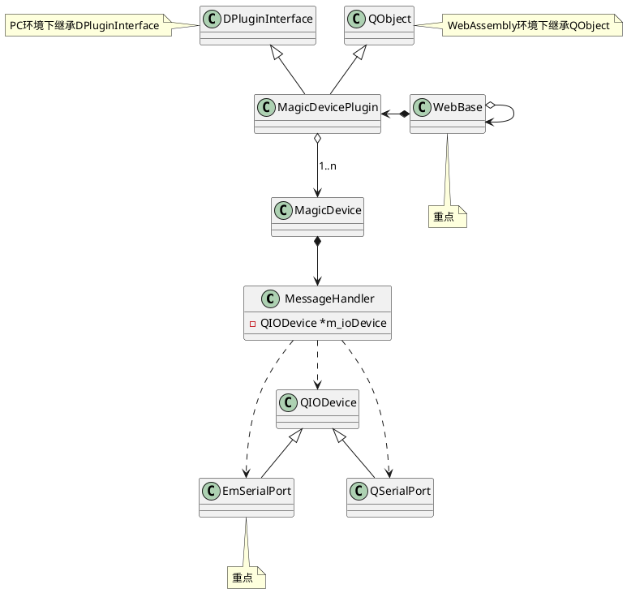
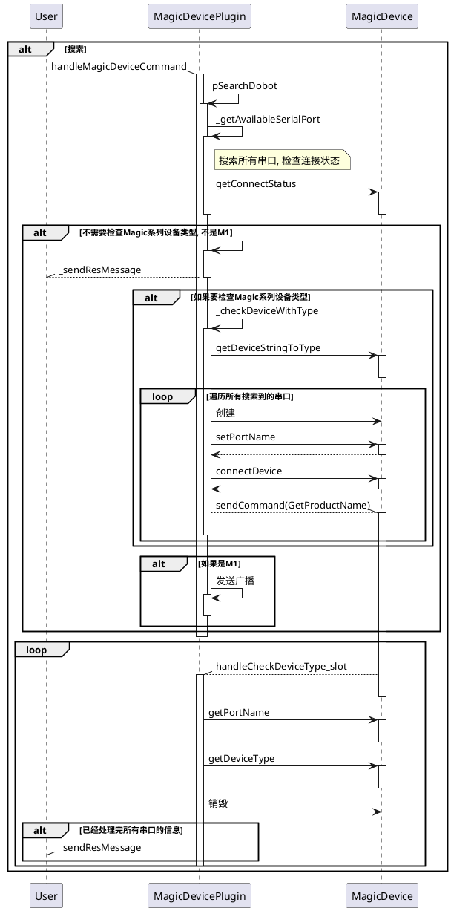
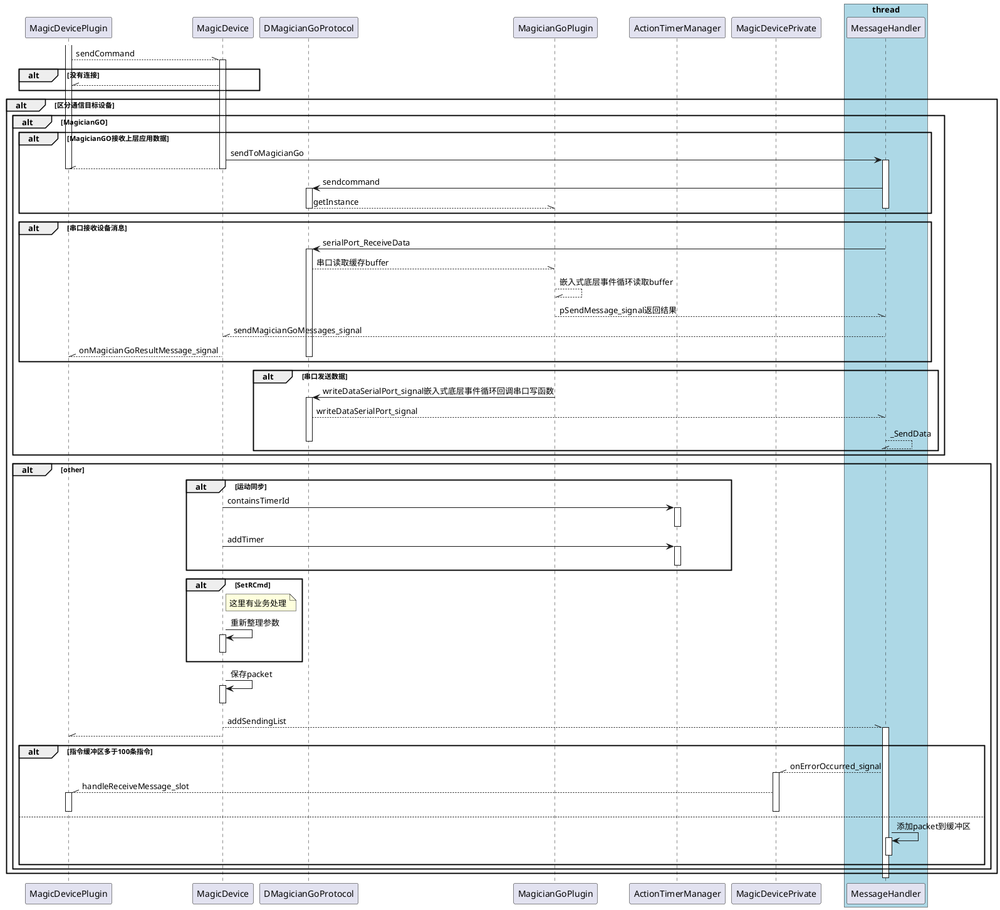
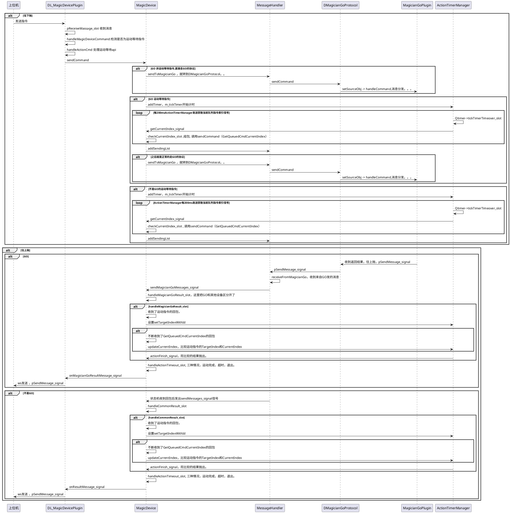
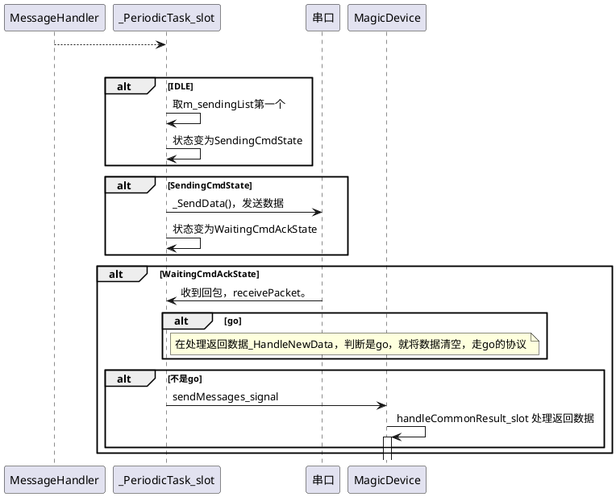

<!-- TOC -->

- [1. WASM 版本](#1-wasm-版本)
- [1. WebAssembly类图](#1-webassembly类图)
- [2. 类图](#2-类图)
- [3. Plugin 和 Dll 的交互](#3-plugin-和-dll-的交互)
    - [3.1. 搜索时序图](#31-搜索时序图)
    - [3.2. 连接时序图](#32-连接时序图)
    - [3.3. 断开连接时序图](#33-断开连接时序图)
    - [3.4. 停止队列](#34-停止队列)
    - [3.5. 下载代码](#35-下载代码)
- [4. Dll 内部交互](#4-dll-内部交互)
    - [4.1. 通讯](#41-通讯)
- [5. MagicDevice 时序图](#5-magicdevice-时序图)
    - [5.1. MessageHandler 的状态机时序图](#51-messagehandler-的状态机时序图)

<!-- /TOC -->

# 1. WASM 版本

1. 阅读注意事项
    1. 除了浏览器支持的部分，大多数通讯模块的功能都不能用
    2. 文件操作只能针对浏览器里的沙盒环境
    3. 91 版本以上的 chrominm 内核才能使用 wasm 功能，建议使用 95 以上版本开发，内含 c/c++代码调试功能
    4. 多线程是能支持的，多进程还不支持，以后会支持。开启多线程功能要在 Qt 编译的时候传入指定参数
    5. 注意js的事件循环和Qt的事件循坏耦合
        1. 如果整个页面都是Qt开发的，使用app的exec即可，不用考虑这个问题
        2. 如果Qt部分作为模块引入，像MagicDivicePlugin这样
            1. 必须在js层定时调用Qt的事件处理函数，Emscripten可能有留对应的接口，但是我没找到
            2. 在Qt槽中，使用await方式，等待js**异步**函数百分百会出现死等。因为Qt事件处理嵌套在js时间循环中，js的异步函数不可能在Qt槽返回前执行。
            3. 参照quamash，asyncio和Qt另个事件循环的结合也是事件处理相互嵌套，唯一不同的思路是，事件嵌套的方式。quamash是在Qt事件内**异步**调用python事件，现在wasm中是在js事件内**同步**调用Qt事件就会出问题。
        4. 只要浏览器调试窗口出现了类似“不能同时等待两个promise”的错误提示，证明有js事件和Qt事件相互死等了。出现这种情况，不一定会卡界面，因为Qt事件循环有可能以其他方式被调起，具体看Qt层业务的实现。
    5. 测试数据
        1. 单独使用web serial api进行Magicin的GetPose操作，时延在5~12ms
        2. 使用wasm调用web serial api进行Magicin的GetPose操作，时延在1-9ms
        3. Emscripten的stdlib+QtBase编译出wasm体积为3MB，添加QtGui模块wasm体积增加10MB，添加Emscripten的pthread模块wasm体积增加3MB
1. 参照[Qt 官方文档](https://doc.Qt.io/Qt-5/wasm.html)配置环境并编译 Qt
    1. 版本推荐
        1. macOS 10.15.7
        2. Qt 5.15.2
        3. emsdk 2.0.27
    2. 编译 Qt 时要带 pthread 参数
1. 执行指令编译 MagicDevicePlugin，需要调试代码就
    ```bash
    cd Plugins/MagicDevicePlugin
    make clean
    /Qt/path/qmake MagicDevicePlugin.pro CONFIG+=wasm
    make -j6
    ```
1. 调试
    1. 启动 Web 服务
        ```bash
        cd Plugins/MagicDevicePlugin
        python ServerTestWASM.py
        ```
    1. 安装 Chrome95 以上
    1. 根据[官方教程](https://developer.chrome.com/blog/wasm-debugging-2020/)打开 wasm 的调试功能

# 1. WebAssembly类图



# 2. 类图

```plantuml
@startuml
class MessagePacket {
    + MessagePacket(QString cmd = QString(), quint64 id = 0);
    + quint64 id;
    + bool isEmpty();
    + void setCommand(QString cmd);
    + QString getCmdStr();
    + void setIsQueue(bool isQueued);
    + bool getIsQueue();
    + void setParams(QJsonObject params);
    + QJsonObject getParamsObj();
    + void setSlaveID(quint8 slaveid);
    + quint8 getSlaveID();
    + void setTargetType(DeviceType type);
    + void setTargetType(QString typeStr, quint8 slaveIndex = 0);
    + DeviceType getTargetType();
    + QString getTargetTypeStr();
    + void setWaitForFinishEnable(bool enable, int timeout = 10000);
    + bool getIsWaitForFinish();
    + int getTimeoutValue();
    + QJsonObject getPacketObj();
    + void setPrivatePacket(bool isPrivate); // just for INTERNAL ONLY

    - {static} void initDeviceTypeStringMap();
    - bool m_isWaitForFinish;
    - int m_timeout;
    - QString m_cmd;
    - int m_cmdid;
    - int m_rw;
    - QString m_rwType;
    - quint8 m_slaveID;
    - bool m_isQueued;
    - QJsonObject m_params;
    - DeviceType m_targetType;
    - bool m_isPrivate;
}

class MagicDevice {
    + explicit MagicDevice(QObject *parent = nullptr);
    + MagicDevice(DeviceType type = DEVICE_UNKNOWN, QObject *parent = nullptr);
    + virtual ~MagicDevice();
    + {static} QString getDeviceTypeToString(DeviceType type);
    + {static} DeviceType getDeviceStringToType(QString type);
    + {static} QString getProtocolVersion();
    + {static} QStringList getCommandList(QString deviceType);
    + {static} QStringList getDeviceList(bool isFiltered = false);
    + void setDeviceType(DeviceType type);
    + DeviceType getDeviceType();
    + void setPortName(QString portName);
    + QString getPortName();
    + void setWebsocketPort(quint16 wsport);
    + quint16 getWebsocketPort();
    + void setHostIpAddress(QString ip);
    + void setDeviceIpAddress(QString ip);
    + void connectDevice(quint64 requestid = 0);
    + void disConnectDevice(quint64 requestid = 0);
    + QString getConnectStatus();
    + void setCommuTimeout(int ms = 3000);
    + bool sendCommand(MessagePacket &packet, bool connectCheck = true);
    + bool sendCommandList(quint64 id, DPacketList packetList, bool enCheck = true);
    + void stopQueueCmdTimer();
    + void onResultMessage_signal(quint64 id, QString cmd, int res = 0, QJsonValue + params = QJsonValue());
}

class MagicDevicePrivate {
    + MagicDevicePrivate(MagicDevice *parent);
    + virtual ~MagicDevicePrivate();
    + {static} QMap<int, QString> DeviceTypeMap;
    + {static} QMap<int, QString> initDeviceTypeStringMap();
    + {static} QString checkIsIpAddress(QString ip);
    + quint16 m_wsport;
    + int m_deviceType;
    + float poseX;
    + float poseY;
    + float poseZ;
    + float poseR;
    + ConnectStatus m_status;
    + typedef QList<MessagePacket> DPacketList;
    + QMap<quint64, MessagePacket> m_RequestMap;
    + QMap<quint64, DPacketList> m_PacketListMap;
    + MessageHandler *m_MessageHandler;
    + Qthread *m_thread;
    + ActionTimerManager *m_actionTimerManager;

    - void checkCurrentIndex_slot();
    - void handleConnectResult_slot(int code, quint64 id);
    - void handleErrorResult_slot(int code, quint64 id);
    - void handleCommonResult_slot(QJsonObject message);
    - void handleActionTimeout_slot(quint64 id, ActionTimerManager::FinishType type);
}

class ActionTimerSet {
    + ActionTimerSet(quint64 id = 0);
    + bool isTimeOver;
    + bool isUpdated;
    + int timeoutValue;
    + quint64 id;
    + QString cmd;
    + quint64 targetIndex;
    + QString targetType;
    + quint8 slaveIndex;
}

class ActionTimerManager {
    + explicit ActionTimerManager(QObject *parent = nullptr);
    + ~ActionTimerManager();
    + void addTimer(ActionTimerSet *timer);
    + void setTargetIndexWithId(quint64 id, quint64 index);
    + void updateCurrentIndex(quint64 index);
    + void clearTimers();
    + bool containsTimerId(quint64 id);
    + quint64 getCurrentHandlingId();
    + QString getCurrentTargetType();
    + quint8 getCurrentSlaveIndex();
    + void getCurrentIndex_signal();
    + void actionFinish_signal(quint64 id, FinishType type);

    - Qtimer *m_actionFinishTimer;
    - Qtimer *m_tickTimer;
    - bool isUpdated;
    - quint64 m_currentIndex;
    - QList<ActionTimerSet*> m_timerSetList;
    - void tickTimerTimeover_slot();
    - void actionFinishTimeover_slot();
}

class PacketCtrl {
    + quint8 c_rw;
    + bool c_isQueued;
    + quint8 c_targetType;
    + quint8 c_slaveid;
    + PacketCtrl();
    + void setPacketCtrl(const quint8 ctrl);
    + void clear();
    + quint8 getPacketCtrl();
    + QString getTargetType();
    + QString getRWType();
    + int getSlaveID();
}

class PacketPayload {
    + quint8 p_cmdID;
    + PacketCtrl p_ctrl;
    + QByteArray p_params;
    + PacketPayload();
    + void setPacketPayload(QByteArray payload);
    + QByteArray getPacketPayload();
    + void clear();
}

class DPacket {
    + explicit DPacket(quint64 id = 0);
    + bool isEmpty();
    + void clear();
    + void setPacketID(quint64 id);
    + quint64 getPacketID();
    + int setPacket(QByteArray data);
    + bool setPacket(QJsonObject data);
    + QJsonObject getMessage();
    + QByteArray getPacketData();
    + int getCommondID();
    + void setPrintDetailMode(bool en);
    + void setPrivate(bool en);
    + bool isPrivate();
    + void setDeviceType(QString type);
    + QString getDeviceType();

    - quint64 m_id;
    - bool m_isEmpty;
    - bool m_isDetailMode;
    - PacketPayload m_payload;
    - bool m_isPrivate;
    - QString m_deviceType;
    - quint8 _getCheckSum(QByteArray payload);
}

class MagicianGoPlugin {

}

class DMagicianProtocol {

}

class DM1Protocol {

}

class DMagicianGoProtocol{
    + static DMagicianGoProtocol *getInstance();
    + void sendCommand(const QJsonObject &obj);
    + void serialPort_ReceiveData(QByteArray byteArray);
    + void connectDevice();
    + void pSendMessage_signal(QJsonObject obj);
    + void serialPort_ReceiveData_signal(QByteArray byteArray);
    + void writeDataSerialPort_signal(QByteArray byteArray);

    - QJsonObject m_sourceObj;
}

class MessageHandler {
    + explicit MessageHandler(QObject *parent = nullptr);
    + ~MessageHandler();
    + void setProtocolType(ProtocolType type);
    + bool isConnected();
    + void setPortName(QString portName);
    + QString getPortName();
    + void setHostIpAddress(QString ip);
    + void setUdpIpAddress(QString ip);
    + QString getUdpIpAddress();
    + void setDeviceUdpPort(quint16 port);
    + Q_INVOKABLE void connectDevice(quint64 id = 0);
    + Q_INVOKABLE void disconnectDevice(quint64 id = 0);
    + Q_INVOKABLE void addSendingList(DPacket packet);
    + Q_INVOKABLE void setTimeoutValue(int ms);
    + void onConnectStatus_signal(int code, quint64 id = 0);
    + void sendMessages_signal(QJsonObject message);
    + void onErrorOccurred_signal(int code, quint64 id = 0);

    - ProtocolType m_ProtocolType;
    - bool m_isConnected;
    - QList<DPacket> m_sendingList;
    - bool isSerialConnection;
    - QSerialPort *m_serialPort;
    - QUdpSocket *m_udpSocket;
    - QString m_localhostIp;
    - QString m_deviceUdpIp;
    - quint16 m_deviceUdpPort;
    - DPacket currentPacket;
    - DPacket receivePacket;
    - QByteArray m_rxBuffer;
    - Qtimer *m_PeriodTimer;
    - Qtimer *m_TimeOutTimer;
    - Qtimer *m_KeepAliveTimer;
    - int m_TimeoverMs;
    - bool m_isTimeOver;
    - int m_resendCount;
    - quint64 m_connectCmdID;
    - void _SerialPortInit();
    - void _UdpSocketInit();
    - void _TimerInit();
    - bool _bindLocalHostIp();
    - void _SendData(QByteArray data);
    - void _HandleNewData(QByteArray newdata);
    - void _PeriodicTask_slot();
    - void onSerialReadyRead_slot();
    - void onReadDatagram_slot();
}


!define Lay_D(e_from, e_to) e_from -[hidden]D- e_to
!define Lay_U(e_from, e_to) e_from -[hidden]U- e_to
!define Lay_R(e_from, e_to) e_from -[hidden]R- e_to
!define Lay_L(e_from, e_to) e_from -[hidden]L- e_to
Lay_D(MessagePacket, DMagicianProtocol)
Lay_D(DMagicianProtocol, DM1Protocol)
Lay_D(DM1Protocol, DMagicianGoProtocol)

DMagicianGoProtocol o--> DMagicianGoProtocol
DMagicianProtocol o--> DMagicianProtocol
DM1Protocol o--> DM1Protocol
PacketPayload "1" *--> "1" PacketCtrl
DMagicianProtocol ..> PacketPayload
DM1Protocol ..> PacketPayload
DMagicianGoProtocol ..>MagicianGoPlugin
MessageHandler "1" o--> "n" DPacket
ActionTimerManager "1" o--> "n" ActionTimerSet
MagicDevicePrivate "1" *-l-> "1"  MessageHandler
MagicDevicePrivate *--> ActionTimerManager
MagicDevice .r.> DMagicianProtocol
MagicDevice .r.> DM1Protocol
MagicDevice .r.> DMagicianGoProtocol
MagicDevice .l.> MagicDevicePrivate
MagicDevice ..> MessagePacket
@enduml
```



# 3. Plugin 和 Dll 的交互

## 3.1. 搜索时序图



## 3.2. 连接时序图

## 3.3. 断开连接时序图

## 3.4. 停止队列

## 3.5. 下载代码

# 4. Dll 内部交互

## 4.1. 通讯



# 5. MagicDevice 时序图



## 5.1. MessageHandler 的状态机时序图


