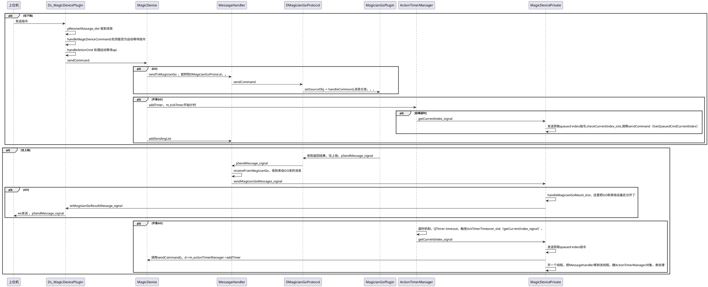

```plantuml
@startuml
alt 往下抛
上位机 -> DL_MagicDevicePlugin: 发送指令
DL_MagicDevicePlugin -> DL_MagicDevicePlugin: pReceiveMassage_slot 收到消息
DL_MagicDevicePlugin -> DL_MagicDevicePlugin: handleMagicDeviceCommand:检测是否为运动等待指令
DL_MagicDevicePlugin -> DL_MagicDevicePlugin: handleActionCmd 处理运动等待api
DL_MagicDevicePlugin -> MagicDevice: sendCommand
alt GO
MagicDevice -> MessageHandler: sendToMagicianGo ，就转到DMagicianGoProtocol。。
MessageHandler -> DMagicianGoProtocol: sendCommand
DMagicianGoProtocol -> MagicianGoPlugin: setSourceObj -> handleCommand,消息分发。。。
end
alt 不是GO
MagicDevice -> ActionTimerManager: addTimer，m_tickTimer开始计时
alt 如果超时
ActionTimerManager -> MagicDevicePrivate: getCurrentIndex_signal
MagicDevicePrivate -> MagicDevicePrivate: 发送获取queued index指令,checkCurrentIndex_slot,调用sendCommand（GetQueuedCmdCurrentIndex）
end
MagicDevice -> MessageHandler: addSendingList
end
end
alt 往上抛
MagicianGoPlugin -> DMagicianGoProtocol: 收到返回结果，往上抛，pSendMessage_signal
DMagicianGoProtocol -> MessageHandler: pSendMessage_signal
MessageHandler -> MessageHandler: receiveFromMagicianGo，收到来自GO发的消息
MessageHandler -> MagicDevicePrivate: sendMagicianGoMessages_signal
alt GO
MagicDevicePrivate -> MagicDevicePrivate: handleMagicianGoResult_slot，这里把GO和其他设备区分开了
MagicDevicePrivate -> DL_MagicDevicePlugin: onMagicianGoResultMessage_signal
DL_MagicDevicePlugin -> 上位机:ws发送 ，pSendMessage_signal
end
alt 不是GO
ActionTimerManager -> ActionTimerManager : 超时机制，QTimer::timeout，触发tickTimerTimeover_slot（getCurrentIndex_signal），
ActionTimerManager -> MagicDevicePrivate: getCurrentIndex_signal
MagicDevicePrivate -> MagicDevicePrivate: 发送获取queued index指令
MagicDevicePrivate -> MagicDevice: 调用sendCommand()，d->m_actionTimerManager->addTimer
MagicDevicePrivate -> MagicDevicePrivate: 开一个线程，把MessageHandler移到该线程，建ActionTimerManager对象，来处理
end
end
@enduml
```