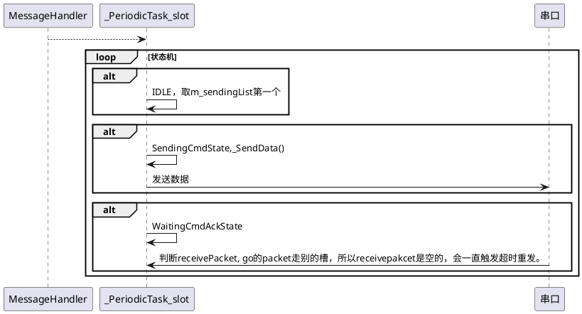

```plantuml
@startuml
MessageHandler --> _PeriodicTask_slot: 
loop 状态机
alt
_PeriodicTask_slot -> _PeriodicTask_slot: IDLE，取m_sendingList第一个
end
alt
_PeriodicTask_slot -> _PeriodicTask_slot: SendingCmdState,_SendData()
_PeriodicTask_slot -> 串口: 发送数据
end
alt
_PeriodicTask_slot -> _PeriodicTask_slot: WaitingCmdAckState
串口 -> _PeriodicTask_slot: 判断receivePacket, go的packet走别的槽，所以receivepakcet是空的，会一直触发超时重发。
end
end
@enduml
```