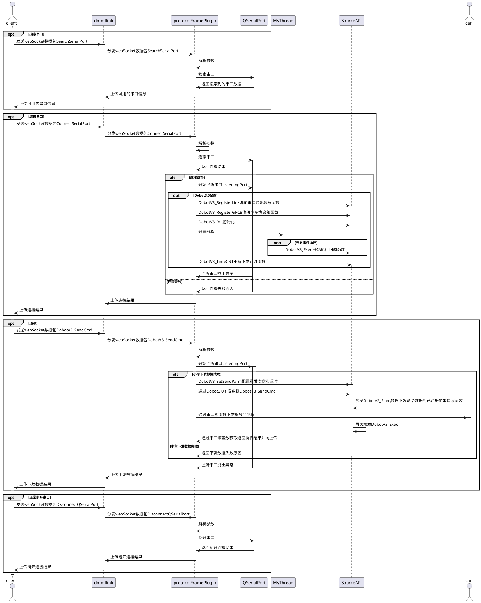
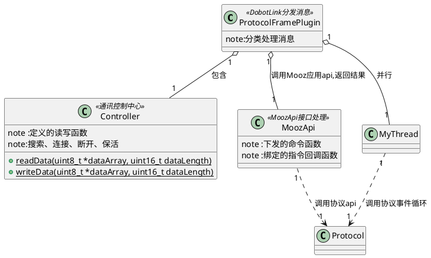

 时序图

```plantuml
@startuml
actor client order 1
actor car order 10

participant dobotlink order 2
participant protocolFramePlugin order 3
participant QSerialPort  order 4
participant MyThread  order 5
participant SourceAPI  order 6

activate client
opt 搜索串口
client -> dobotlink : 发送webSocket数据包SearchSerialPort
activate dobotlink
dobotlink -> protocolFramePlugin : 分发webSocket数据包SearchSerialPort
activate protocolFramePlugin
protocolFramePlugin -> protocolFramePlugin : 解析参数
protocolFramePlugin -> QSerialPort : 搜索串口
QSerialPort -> protocolFramePlugin : 返回搜索到的串口数据
protocolFramePlugin -> dobotlink : 上传可用的串口信息
deactivate protocolFramePlugin
dobotlink -> client : 上传可用的串口信息
deactivate dobotlink
end

opt 连接串口
client -> dobotlink : 发送webSocket数据包ConnectSerialPort
activate dobotlink
dobotlink -> protocolFramePlugin : 分发webSocket数据包ConnectSerialPort
activate protocolFramePlugin
protocolFramePlugin -> protocolFramePlugin : 解析参数
protocolFramePlugin -> QSerialPort : 连接串口
activate QSerialPort

QSerialPort -> protocolFramePlugin : 返回连接结果
alt 连接成功
protocolFramePlugin -> QSerialPort : 开始监听串口ListeningPort
opt Dobot3.0配置


protocolFramePlugin -> SourceAPI : DobotV3_RegisterLink绑定串口通讯读写函数
activate SourceAPI
protocolFramePlugin -> SourceAPI : DobotV3_RegisterGRCB注册小车协议和函数
protocolFramePlugin -> SourceAPI : DobotV3_Init初始化
protocolFramePlugin -> MyThread : 开启线程
loop 开启事件循环
MyThread -> SourceAPI : DobotV3_Exec 开始执行回调函数
end
protocolFramePlugin -> SourceAPI : DobotV3_TimeCNT不断下发计时函数
deactivate SourceAPI

end
QSerialPort -> protocolFramePlugin : 监听串口抛出异常
else 连接失败
QSerialPort -> protocolFramePlugin : 返回连接失败原因
deactivate QSerialPort
end

protocolFramePlugin -> dobotlink : 上传连接结果
deactivate protocolFramePlugin
dobotlink -> client : 上传连接结果
deactivate dobotlink
end

opt 通讯
client -> dobotlink : 发送webSocket数据包DobotV3_SendCmd
activate dobotlink
dobotlink -> protocolFramePlugin : 分发webSocket数据包DobotV3_SendCmd
activate protocolFramePlugin
protocolFramePlugin -> protocolFramePlugin : 解析参数
protocolFramePlugin -> QSerialPort : 开始监听串口ListeningPort
activate QSerialPort

alt 小车下发数据成功
protocolFramePlugin -> SourceAPI : DobotV3_SetSendParm配置重发次数和超时
activate SourceAPI
protocolFramePlugin -> SourceAPI : 通过Dobot3.0下发数据DobotV3_SendCmd

SourceAPI -> SourceAPI : 触发DobotV3_Exec,转换下发命令数据到已注册的串口写函数
protocolFramePlugin -> car : 通过串口写函数下发指令至小车
activate car
SourceAPI -> SourceAPI : 再次触发DobotV3_Exec

car -> protocolFramePlugin :  通过串口读函数获取返回执行结果并向上传
deactivate car

else 小车下发数据失败
SourceAPI -> protocolFramePlugin : 返回下发数据失败原因

deactivate SourceAPI
end
QSerialPort -> protocolFramePlugin : 监听串口抛出异常
deactivate QSerialPort

protocolFramePlugin -> dobotlink : 上传下发数据结果
deactivate protocolFramePlugin
dobotlink -> client : 上传下发数据结果
deactivate dobotlink
end

opt 正常断开串口
client -> dobotlink : 发送webSocket数据包DisconnectQSerialPort
activate dobotlink
dobotlink -> protocolFramePlugin : 分发webSocket数据包DisconnectQSerialPort
activate protocolFramePlugin
protocolFramePlugin -> protocolFramePlugin : 解析参数
protocolFramePlugin -> QSerialPort : 断开串口

QSerialPort -> protocolFramePlugin : 返回断开连接结果

protocolFramePlugin -> dobotlink : 上传断开连接结果
deactivate protocolFramePlugin
dobotlink -> client : 上传断开连接结果
deactivate dobotlink
end
deactivate client

@enduml
```

uml类图

```plantuml
@startuml
class ProtocolFramePlugin<<DobotLink分发消息>> {
    note:分类处理消息
}

class Controller<<通讯控制中心>> {
    note :定义的读写函数
    {static}+readData(uint8_t *dataArray, uint16_t dataLength)
    {static}+writeData(uint8_t *dataArray, uint16_t dataLength)
    note:搜索、连接、断开、保活
}

class MoozApi<<MoozApi接口处理>> {
   note :下发的命令函数
   note :绑定的指令回调函数
}

MoozApi "1" ..> "1" Protocol : 调用协议api
MyThread "1" ..> "1" Protocol : 调用协议事件循环
ProtocolFramePlugin "1" o-- "1" Controller : 包含
ProtocolFramePlugin "1" o-- "1" MyThread : 并行
ProtocolFramePlugin "1" o-- "1" MoozApi : 调用Mooz应用api,返回结果
@enduml
```
